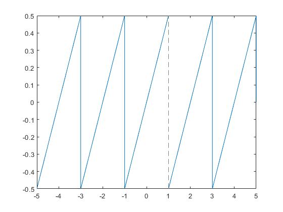
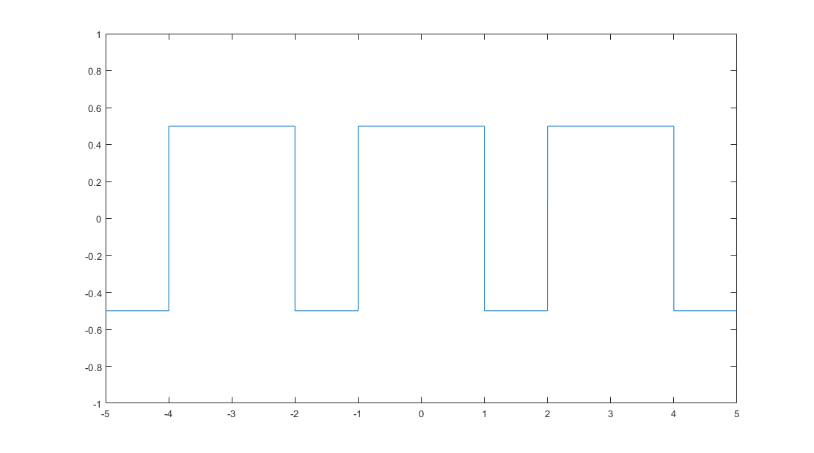

# Fourier Synthesis
Fourier Synthesis Matlab Demo App.  

  

Built with App Designer, Symbolic Math Toolbox.  
Because of limitations regarding redistribution of code/functionality contained in the Symbolic Math Toolbox it doesn't do coefficient calculation in real time. Workig around the limitations lead to pre-calculated Fourier Coefficients being used.   
Since this is more of a teaching tool that limitation is not a deal breaker. But you should be aware of it.  
We're doing signals (and systems), that's why there is no units (at least on the y-axis). Imagine this being some voltage having been normalized to a maximum amplitude of "1".

# How Fourier Coefficients / Functions are prepared  
- Set up Matlab for symbolic computation of Fourier Coefficients: 
```
syms x k L n
evalin(symengine,'assume(k,Type::Integer)');
```  
- Define function that is to be approxiated:

```
% Triangular Puse Train
f= triangularPulse(-1,1,1,x)  + triangularPulse(-1,1,1,x-2) + triangularPulse(-1,1,1,x-4) + triangularPulse(-1,1,1,x+2) + triangularPulse(-1,1,1,x+4)- .5
% Save function to Matlab file for later use in the app:
matlabFunction(f,'File','saegezahn')
```

- Define functions for symbolic coefficient calculation: 
```
% a coefficients (cosine)
a = @(f,x,k,L) int(f*cos(k*pi*x/L)/L,x,-L,L);
% b coefficients (sine)
b = @(f,x,k,L) int(f*sin(k*pi*x/L)/L,x,-L,L);
% complex coefficients
c = @(f,x,k,L) 1/(2*L) * int( f * exp(-j*2*pi*k*x/(2*L))  , x,-L,L);
```
- Define symbolic sum (n-th order) approximating the original function (sawtooth pulse train):
```
% fs is computation via coefficients a and b
fs = @(f,x,n,L) a(f,x,0,L)/2 + symsum(a(f,x,k,L)*cos(k*pi*x/L) + b(f,x,k,L)*sin(k*pi*x/L),k,1,n);
% fc is computation via complex coefficients
% this is not als slick as it could be 
% symsum will fail at k=0 when running k from -n..+n
% so we split the computation into three parts (negative, zero, positive)
fc = @(f,x,n,L) symsum( c(f,x,k,L)* exp(j*k*2*pi*x/(2*L)) ,k,1,n)+ symsum( c(f,x,k,L)* exp(j*k*2*pi*x/(2*L)) ,k,-n,-1) + c(f,x,0,L)*exp(j*0*2*pi*x/(2*L));

```

- Do a quick check of the computations:
```
% Plot second order approximation
% T is 2, L=T/2=1, n=2
fplot(fs(f,x,2,1))
% Continue plotting into the same figure, keep previous plots
hold on
% Plot original function
fplot(f)
% Set limits
xlim([-3,3])
% Next plot command will erase previous plots
hold off
legend( 'Approximation', 'Sawtooth Function')
```


- Pre-compute Fourier Coefficients up to order 10:
```
% Compute a coefficients
for R = 0:10
 saegezahn_a(R+1) = a(f,x,R,1); 
end
% Compute b coefficients
for R = 0:10
 saegezahn_b(R+1) = b(f,x,R,1); 
end
% compute complex coefficients
for R = 0:10
 saegezahn_c(R+1) = c(f,x,R,1); 
end

% Save to Matlab function file ('.m')
matlabFunction(saegezahn_b,'File','koeff_saegezahn_b')
matlabFunction(saegezahn_a,'File','koeff_saegezahn_a')
matlabFunction(saegezahn_c,'File','koeff_saegezahn_c')
```

- Save Latex string for later display in app:
```
% oder anders als ein koeffizient pro zeile
fid = fopen('saegezahn_b_lstr.txt','wt');
for R=1:11
  fprintf(fid, '%s \n', latex(saegezahn_b(R)));
end
fclose(fid)
fid = fopen('saegezahn_a_lstr.txt','wt');
for R=1:11
  fprintf(fid, '%s \n', latex(saegezahn_a(R)));
end
fclose(fid)
fid = fopen('saegezahn_c_lstr.txt','wt');
for R=1:11
  fprintf(fid, '%s \n', latex(saegezahn_c(R)));
end
fclose(fid)

```

- Now, there's Fourier Coefficients (real and complex) up to order 10 and the original function in a file for later use in the app.

# Implemented Functions
## Sawtooth 1

```
f = triangularPulse(-1,1,1,x)  + triangularPulse(-1,1,1,x-2) + triangularPulse(-1,1,1,x-4) + triangularPulse(-1,1,1,x+2) + triangularPulse(-1,1,1,x+4)- .5
```
Period is 2.

## Sawtooth 2

```
f = triangularPulse(-1,1,1,x+1)  + triangularPulse(-1,1,1,x-1) + triangularPulse(-1,1,1,x-3) + triangularPulse(-1,1,1,x+3) + triangularPulse(-1,1,1,x+5)- .5
```
Period is 2.

## Rectangular 1

```
f = rectangularPulse(-1,1,x)  + rectangularPulse(-1,1,x-3) + rectangularPulse(-1,1,x+3) -.5
```
Period is 3.

# Acknowledgements 

Basic Idea:  https://www3.nd.edu/~nancy/Math30650/Matlab/Demos/fourier_series/fourier_series.html
